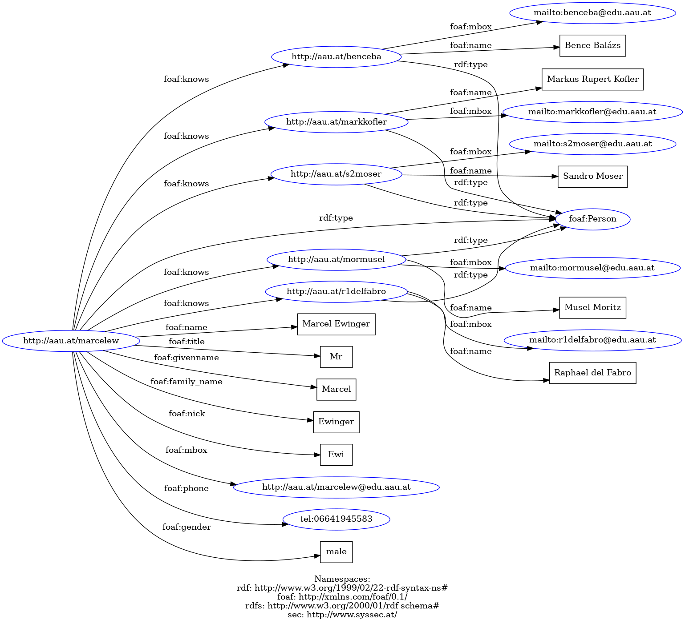

Semantic Web Technologies Konstantin Schekotihin

# Exercise sheet - RDF/RDFS

1. Create a FOAF document listing members of the class whom you know and some friends not
    visiting the class. In each document specify the “knows” relation for your friends. You can use
    FOAF-a-Matic^1 to generate stubs. Define all Person URIs as [http://aau.at/#ZIDLogin](http://aau.at/#ZIDLogin) for each
    member of your class, where ZIDLogin is substituted with your login, and arbitrary URLs for other
    friends. Use these URIs in your FOAF documents instead of searching. Present your RDF
    document in RDF/XML and Turtle (aka N3) serialization formats. Please, fill out at least five fields
    suggested in FOAF-a-Matic input form with personal information. Define at least one FOAF term
    about yourself that is not suggested in the form (see FOAF vocabulary description^2 for a list of
    terms).  
    <br>
    
2. Display your documents as a graph (you can use Protege^3 editor or RDF Validator^4 ). Exchange
    documents with your friends in the class and merge them into one. Present the result as a graph.
    <br>
    
    <br>
    <br>


3. Model the following sentences in RDF (Turtle). If possible use URI from schemas available at
    schema.org or GoodRelations whenever possible or use other vocabularies if the previous two
    do not comprise relevant concepts and relations:

    * a. Peter is a person
    * b. Every student is a person
    * c. Jonas and Rosemary are children of Peter, who are 3 and 5
    * d. Mark IV is developed by Canon for professional photographers
    * e. My friend told me that a person who owns a cat is a woman
  
  <br>

4. What is JSON-LD serialization format for RDF? Convert the document obtained in the previous
    exercise to JSON-LD and use RDF-translator to check your results.

    
    JSON-LD (JSON for Linked Data) is a serialization format for RDF (Resource Description Framework) data, designed to be easy to read and write for humans and easy to parse and generate for machines. It allows RDF data to be represented in JSON format while maintaining compatibility with RDF semantics.
    https://www.easyrdf.org/converter
    

5. Select an HTML page (e.g. some small article from Wikipedia) and introduce RDF annotations in
    RDFa or JSON-LD formats to it. You can use Google Structured Data Testing Tool (see
    Documentation for more details).

   *  This JSON-LD code describes a list of items (itemListElement), each formatted as individual list items (ListItem). The list is defined as an ItemList.

   * @context: Specifies the context for interpreting the data. Here, the Schema.org context is used, indicating that the data should be interpreted according to Schema.org specifications.
     * @type: Specifies the type of the main object. Here, it's ItemList, indicating that it's a list of items.
    itemListElement: This is the main field containing the list of elements.
    Each element in the list has:
      * @type: The type of the element. Here, it's ListItem, indicating that it's a list item.
      * position: The position of the element in the list.
      * name: The name of the element. Here, the names are carrot, broccoli, and tomato, representing the vegetable names.
      * url: The URL representing the element. Here, the URLs point to the respective pages on DBpedia containing information about each vegetable.
 * In summary, this JSON-LD code describes a list of vegetables with their names, positions in the list, and corresponding URLs.

    https://validator.schema.org/

    
6. Use Jena^5 command line tools (riot.bat) to convert the student.rdf into Turtle syntax. Explain
    the meaning of the meaning of the triples. See [http://jena.apache.org/documentation/io/](http://jena.apache.org/documentation/io/) for
    help.

    * Download Apache Jana and save it
    * Add environmental variable
    * Open CMD
    * Navigate where student.rdf is saved
    * Execute comment riot --output=ttl student.rdf >> student.ttl
    * Finished
  
    <br>
7. Use Jena RDFS inference engine to obtain RDFS entailments (infer.bat) of student.rdf and
    save only inferred axioms in the Turtle format. Explain why these triples are derived using
    common sense reasoning.
    <br>
8. Similarly as in (7) apply inference to axel.rdf using FOAF as RDFS vocabulary.

(^1) [http://www.ldodds.com/foaf/foaf-a-matic.html](http://www.ldodds.com/foaf/foaf-a-matic.html)

(^2) [http://xmlns.com/foaf/0.1/](http://xmlns.com/foaf/0.1/)

(^3) https://protege.stanford.edu/software.php

(^4) [http://www.w3.org/RDF/Validator/](http://www.w3.org/RDF/Validator/) do not forget to make an appropriate selection in “Triples and/or Graph”

(^5) Download Jena from [http://jena.apache.org](http://jena.apache.org) (works with Java 6 of higher) and register the JENA_ROOT=Jena/Path
environmental variable


```
Example (Windows PC connected to the Internet):
run cmd.exe, go into a directory where axel.rdf is saved and run:
infer.bat --rdfs=http://xmlns.com/foaf/0.1/index.rdf axel.rdf
Save all inferred triples in the Turtle format. Select five saved triples and explain them using
FOAF vocabulary definitions http://xmlns.com/foaf/spec/
```

9. Create an RDFS ontology describing the following part of a domain that describes pets.
    - All dogs are animals.
    - Parent is a relationship defined for animals.
    - All animals related as parents are also relatives.
    - Jake states that dogs are carnivores.
    - Wikipedia has also a definition of a dog.

Use derivation rules presented in the lecture to obtain simple entailments of the following RDF
document. Use RDFS axiomatic and valid triples, i.e. statements that are always true for every RDFS
document (see Section 9 of RDFS 1.1 Recommendation^6 ), to obtain as much entailments as possible.

10. ex:Mike a foaf:Person.
    ex:Mike ex:friend ex:Jerry.
    ex:friend rdfs:subPropertyOf foaf:knows.

    <br>
    
11. ex:Megan ex:hasParent ex:Mike.
    ex:hasParent rdfs:domain ex:Person.
    ex:Person rdfs:subClassOf ex:Agent.

(^6) [http://www.w3.org/TR/2014/REC-rdf11-mt-20140225/Overview.html#rdfs-interpretations](http://www.w3.org/TR/2014/REC-rdf11-mt-20140225/Overview.html#rdfs-interpretations)


