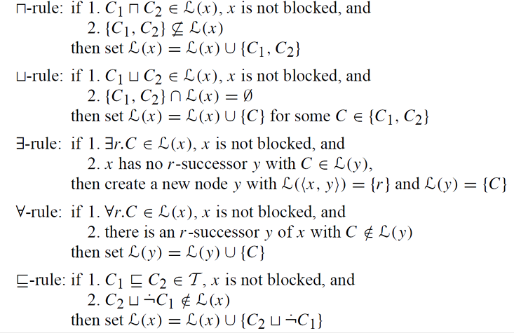

# 1. Translate the following axioms into RDF Turtle
- 𝐻𝑢𝑚𝑎𝑛 ⊑¬𝐴𝑙𝑖𝑒𝑛
    - ⊑--> sublclass
    - ¬ --> negation
    - ⊑¬ --> not in the subclass  
    - “Human” are not members of the class “Alien”

- 𝐹𝑎𝑡ℎ𝑒𝑟𝑊𝑖𝑡ℎ𝐷𝑎𝑢𝑔ℎ𝑡𝑒𝑟𝑠 ⊑ 𝑀𝑎𝑛 ⊓ ∀ ℎ𝑎𝑠𝐶ℎ𝑖𝑙𝑑.𝑊𝑜𝑚𝑎𝑛 
  
  - FatherWithDaughters: This is the class of all individuals that are fathers with daughters.
 
  - ⊑: Indicates that “FatherWithDaughters” is a subclass of what follows.

  - Man: The class of all male individuals.
  
  - ⊓: Denotes the intersection of classes, so “FatherWithDaughters” is a subclass of “Man” and something else.
  
  - ∀hasChild.Woman: This part states that for all relationships described by the property “hasChild”, the children must be members of the class “Woman”.
 
  - “FatherWithDaughters” as a subclass of individuals who are men and have only women as children

- 𝐶ℎ𝑖𝑙𝑑 ⊑ 𝐻𝑢𝑚𝑎𝑛 ⊓ ∃ 𝑝𝑎𝑟𝑒𝑛𝑡.(∃ ℎ𝑎𝑠𝐶ℎ𝑖𝑙𝑑.𝑆𝑒𝑙𝑓)
  - Child: This is the class of all individuals that are children
  
  - ⊑: Indicates that “Child” is a subclass of what follows. 
   
  - Human: The class of all human individuals.
  
  - ⊓: Denotes the intersection of classes, so “Child” is a subclass of “Human” and something else.
  
  - ∃parent: States that there exists at least one relationship described by the property “parent”.
  
  - (∃hasChild.Self): This part specifies that there exists at least one relationship described by the property “hasChild” where the child is the individual itself (reflexive relationship).
  
  - “Child” as a subclass of individuals who are humans and have at least one parent who has a child that is themselves. In other words, it captures the concept of children who are also considered as their own parent’s child, indicating a reflexive relationship

 

# 2. Decide whether the following translations are correct or not. Explain your answer 
-  Each Student had not written a habilitation  
    -  𝑆𝑡𝑢𝑑𝑒𝑛𝑡 ⊑¬(∃𝑤𝑟𝑜𝑡𝑒.𝐻𝑎𝑏𝑖𝑙𝑖𝑡𝑎𝑡𝑖𝑜𝑛) 

    - Axiom Breakdown:
        - Student: represents the class of students. 
        - ⊑: indicates that the left-hand side is a subset of the right-hand side.  
        - ¬(∃wrote.Habilitation): This part means "there does not exist (∃) a writing of a habilitation".

    -  The provided translation correctly represents the intended meaning of "Each student had not written a habilitation". Therefore, the translation is correct.

      
- A conference chair organizes at least one event that is both research and public 
  - 𝐶ℎ𝑎𝑖𝑟 ⊑∀𝑜𝑟𝑔𝑎𝑛𝑖𝑧𝑒𝑠.(𝑅𝑒𝑠𝑒𝑎𝑟𝑐ℎ⊓𝑃𝑢𝑏𝑙𝑖𝑐) 

  - Axiom Breakdown:
    - Chair: Person who is a chair of a conference.
    - ⊑: indicates that the left-hand side is a subset of the right-hand side 
    - ∀organizes.(Research⊓Public): This means that for all events organized by the chair, the events must (dot) be both research and (⊓) public.

  - The translation is false, because it incorrectly uses a universal quantifier instead of an existential quantifier. The correct translation is: Chair⊑∃organizes.(Research⊓Public)
    - ∀ --> "For everyone" or "Everyone"
    - ∃ --> "There is at least one" or "It exists"
  
   

-  Each assistant is a university staff member who cannot teach in a privatissimum (exclusive tutorial) 
    -  𝐴𝑠𝑠𝑖𝑠𝑡𝑎𝑛𝑡 ⊑𝑆𝑡𝑎𝑓𝑓⊓∀𝑡𝑒𝑎𝑐ℎ𝑒𝑠(¬𝑃𝑟𝑖𝑣𝑎𝑡𝑖𝑠𝑠𝑖𝑚𝑢𝑚)

 - Axiom Breakdown:
    - Assistant: The class of assistants.
    - ⊑: Subsumption (subset) operator, meaning the left-hand side is a subset of the right-hand side (Assistent is subClass of Staff)
    - ∀teaches.(¬Privatissimum): means that for all things an assistant teaches, it is not a privatissimum, which aligns with "cannot teach in a privatissimum".

  - The given translation correctly captures the meaning of the English sentence 

  
 

# 3. Decide if the user understood the ontological definitions correctly. Explain your answer. 
   - 𝐶𝑢𝑠𝑡𝑜𝑚𝑒𝑟 ⊑𝑃𝑢𝑏𝑙𝑖𝑐𝑂𝑟𝑔𝑎𝑛𝑖𝑧𝑎𝑡𝑖𝑜𝑛  𝐶𝑢𝑠𝑡𝑜𝑚𝑒𝑟 ⊑𝑀𝑢𝑛𝑖𝑐𝑖𝑝𝑎𝑙𝑖𝑡𝑦 
  
     - A customer is both a public organization and a municipality 
       -  Customer⊑PublicOrganization: This means that every customer is a type of public organization.
       -  Customer⊑Municipality: This means that every customer is also a type of municipality.
       -  The user has correctly understood the ontological definitions. But the user could have also written the expression in an alternative way, using an intersection
          -  Customer ⊑ PublicOrganization ⊓ 𝑀𝑢𝑛𝑖𝑐𝑖𝑝𝑎𝑙𝑖𝑡𝑦
 
  

   - 𝐺𝑢𝑒𝑠𝑡𝑃𝑟𝑜𝑓𝑒𝑠𝑠𝑜𝑟 ⊑¬∀ℎ𝑜𝑙𝑑𝑠.(𝐿𝑒𝑐𝑡𝑢𝑟𝑒⊔𝑆𝑒𝑚𝑖𝑛𝑎𝑟) 
      - If someone holds a Lecture or a seminar, then he/she is a guest professor. 
   
      - Logical Expression:
        - There must be at least one event held by a guest professor that is not a lecture or a seminar.
  
      - English Sentence:
        - "If someone holds a lecture or a seminar, then he/she is a guest professor."
  
      - Conclusion:
        - The English statement and the given logical expression don't match.
 

   - 𝑆𝑒𝑐𝑟𝑒𝑡𝑎𝑟𝑦 ⊑𝑈𝑛𝑖𝐸𝑚𝑝𝑙𝑜𝑦𝑒𝑒   𝑈𝑛𝑖𝐸𝑚𝑝𝑙𝑜𝑦𝑒𝑒 ⊑¬𝑆𝑒𝑐𝑟𝑒𝑡𝑎𝑟𝑦 
      - All secretaries are university employees, but not every employee is a secretary
  
        - Logical Expression:
          - 𝑆𝑒𝑐𝑟𝑒𝑡𝑎𝑟𝑦 ⊑𝑈𝑛𝑖𝐸𝑚𝑝𝑙𝑜𝑦𝑒𝑒 --> every secretary is a university employee. This matches the first half of the english sentence.
  
          - 𝑈𝑛𝑖𝐸𝑚𝑝𝑙𝑜𝑦𝑒𝑒 ⊑¬𝑆𝑒𝑐𝑟𝑒𝑡𝑎𝑟𝑦 --> every university employee is not a secretary. This is not what the English sentence intends to convey. The sentence says that not every employee is a secretary, but the logic says that not every university employee is a secretary. 
  
        - Correct Logic
          - Secretary⊑UniEmployee
          - ¬(UniEmployee⊑Secretary)

 

# 4.Use the ALC rules presented on the slides to check if the following ontology is consistent. Draw the derivation tree and explain how the rules are applied. 
  - 𝑃𝑖𝑧𝑧𝑎 ⊑ 𝐵𝑟𝑒𝑎𝑑⊓∃𝑡𝑜𝑝𝑝𝑖𝑛𝑔.𝐶ℎ𝑒𝑒𝑠𝑒 
  - 𝑃𝑖𝑧𝑧𝑎(𝑀𝑎𝑟𝑔ℎ𝑒𝑟𝑖𝑡𝑎) 
  - 𝑡𝑜𝑝𝑝𝑖𝑛𝑔(𝑀𝑎𝑟𝑔ℎ𝑒𝑟𝑖𝑡𝑎,𝑀𝑜𝑧𝑧𝑎𝑟𝑒𝑙𝑙𝑎)

  - Rules
    - 

  - Logic Expression
    - All pizzas are a type (subClass, ⊑) of bread and have at least one (∃) topping that (dot) is cheese.
  
  -  Step-by-Step ALC Rules
     -  Rule 5
        -  𝑃𝑖𝑧𝑧𝑎 (C1) ⊑ 𝐵𝑟𝑒𝑎𝑑⊓∃𝑡𝑜𝑝𝑝𝑖𝑛𝑔.𝐶ℎ𝑒𝑒𝑠𝑒 (C2)
        -  𝑃𝑖𝑧𝑧𝑎 ⊔ 

  

   

# 5. Use the ALC rules presented on the slides to check if the ontology entails 𝑃𝑟𝑜𝑓(𝑃𝑒𝑡𝑒𝑟). Draw the derivation tree and explain how the rules are applied. Note that 𝐴≡𝐵 (equivalence) is a shortcut for the two axioms 𝐴⊑𝐵 and 𝐵 ⊑𝐴 
  - 𝑆𝑡𝑢𝑑𝑒𝑛𝑡 ⊑∀𝑣𝑖𝑠𝑖𝑡𝑠.𝐿𝑒𝑐𝑡𝑢𝑟𝑒 
  𝑃𝑟𝑜𝑓 ≡∃𝑡𝑒𝑎𝑐ℎ𝑒𝑠.(𝑆𝑒𝑚𝑖𝑛𝑎𝑟⊔𝐿𝑒𝑐𝑡𝑢𝑟𝑒) 
  𝑡𝑒𝑎𝑐ℎ𝑒𝑠(𝑃𝑒𝑡𝑒𝑟,𝐴𝑙𝑔𝑜𝐷𝑎𝑡) 
  𝑆𝑡𝑢𝑑𝑒𝑛𝑡(𝐽𝑜ℎ𝑛) 
  𝑣𝑖𝑠𝑖𝑡𝑠(𝐽𝑜ℎ𝑛,𝐴𝑙𝑔𝑜𝐷𝑎𝑡)
